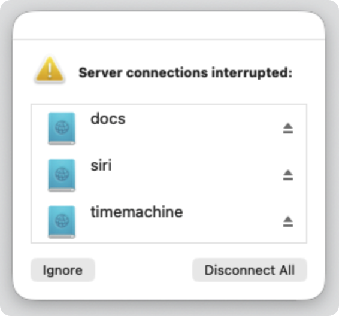
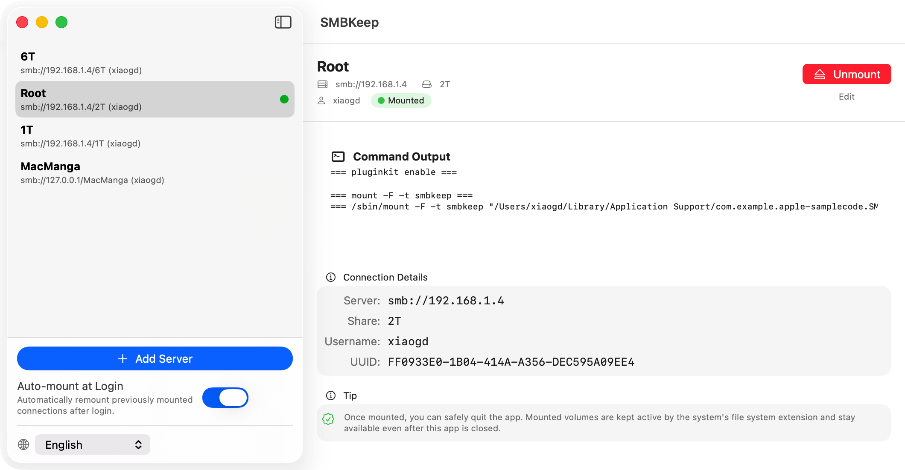

# SMBKeep —— 一个保持常连的 SMB 文件系统

**简体中文** | [English](README.md)

SMBKeep 是一个基于 Apple [FSKit](https://developer.apple.com/documentation/fskit) 框架实现的用户态 SMB 文件系统，目标是替代 macOS Finder 默认的 SMB 连接体验，让网络卷"挂上去就一直在"。

## 下载

[](https://github.com/xiaogdgenuine/smbkeeper/releases/latest)

**[⬇️ 前往 Releases 页面下载最新版本](https://github.com/xiaogdgenuine/smbkeeper/releases/latest)**

> **系统要求：macOS 26.0 及以上。**
> 本项目使用了 macOS 26 才提供的 FSKit API（例如以 `FSPathURLResource` 传递挂载配置），因此**无法在更低版本（含 macOS 15.4）的系统上编译或运行**。

## 什么是 FSKit

[FSKit](https://developer.apple.com/documentation/fskit) 是 Apple 自 macOS 15.4 起引入、并在 macOS 26 进一步完善的框架，允许开发者用**用户态（user space）**代码实现完整的文件系统，无需编写内核扩展（kext）。文件系统逻辑被打包成一个 **App Extension**，由系统的 `fskitd` 托管运行：系统负责挂载生命周期与请求转发，扩展只需实现卷的读写等操作。SMBKeep 正是把 SMB 客户端做进这样一个 FSKit 扩展里，从而完全接管 SMB 卷的挂载与连接保活。

## 这个项目想解决什么

macOS 自带的 SMB 挂载在日常使用中有不少痛点：合盖休眠、切换网络、服务器短暂掉线之后，Finder 经常弹出"服务器连接已断开"的烦人提示，卷也需要手动重新连接。SMBKeep 把 SMB 客户端做进一个 FSKit 文件系统扩展里，自己管理连接和重连，尽量做到"无感保活"。

### 主要特性

- **替代 Finder 默认的 SMB 连接**：用自己的 FSKit 扩展挂载 SMB 共享，而不是依赖系统内置的 SMB 客户端。
- **开机自动挂载所有卷**：登录后自动把已保存的所有连接挂载好，无需手动操作。
- **自动重连 SMB 服务器**：连接中断后在后台自动恢复；即使笔记本合盖再打开，也不会再被"服务器已断开"的弹窗打扰。
- **凭据安全存储**：服务器密码保存在 macOS Keychain 中，仓库与配置文件里都没有明文凭据。

### App 界面

简洁的连接管理界面：左侧是已保存的连接，右侧是详情、挂载状态与操作。

## 效果展示

### 告别 Finder 的 SMB 断联弹窗

合盖休眠、切换网络或服务器短暂掉线后，macOS 自带的 SMB 挂载经常弹出这样的"服务器连接已断开"提示，逼你手动重连：



用 SMBKeep 挂载后，连接的中断与恢复都由 FSKit 扩展在后台默默处理，**不会再出现上面这个弹窗**。



### 合盖休眠也不中断播放

下面演示「播放视频 → 合盖休眠 → 开盖唤醒 → 继续播放」的完整流程，全程无需重新连接、不弹任何提示：

第 1 步，正在播放网络卷上的视频，然后合盖让笔记本进入休眠：

<video src="resources/play_then_goto_sleep.mp4" controls width="640"></video>

第 2 步，等待 10 分钟左右，重新开盖唤醒，视频可以直接继续播放，连接已在后台自动恢复：

<video src="resources/awake_then_continue_play.mp4" controls width="640"></video>

```ff	
注意：Finder 自带的 SMB 实现无法实现休眠后无缝播放，可查阅：https://github.com/iina/iina/issues/5474
```

## 工作原理

```text
┌──────────────────────────┐
│ SMBKeep 主 App            │  管理连接、保存配置、触发挂载、设置开机启动
│ SwiftUI 管理界面，可退出    │
└─────────────┬────────────┘
              │ 调用 /sbin/mount -F -t smbkeep
              ▼
┌──────────────────────────┐
│ fskitd / FSKit            │  系统托管挂载生命周期
└─────────────┬────────────┘
              │ 加载扩展，转发文件系统请求
              ▼
┌──────────────────────────┐
│ SMBKeepAppEx 扩展进程      │  真正持有卷、实现文件读写
│ · 用 libsmb2 连接 SMB      │
│ · 监听网络变化 / 休眠唤醒    │
│ · 连接断开后后台重连        │
└─────────────┬────────────┘
              │ SMB2 / TCP 445
              ▼
┌──────────────────────────┐
│ 远程 SMB 服务器            │
└──────────────────────────┘

登录项启动：
macOS 登录 → 后台启动主 App → 自动挂载上次需要恢复的卷 → App 退出
```

主 App 只负责管理和发起挂载，挂载成功后可以放心退出；已挂载的卷由 `fskitd` 托管的 `SMBKeepAppEx` 扩展进程维持，不依赖主 App 存活。断线、切换网络或休眠唤醒后，扩展会在后台处理连接恢复，尽量让 Finder 里的卷保持可用。

## 关于代码质量的说明

> 这个项目绝大部分代码都是由 AI "Vibe Coding" 生成的。

因此它**几乎肯定存在 bug**，不建议直接当作生产级软件依赖。它的主要价值在于作为一个**FSKit 的实用示例**——展示如何用 FSKit 实现一个真正能用、能挂载远程网络卷、并自行处理连接生命周期的文件系统，而不仅仅是官方文档里的最小 demo。

如果你正在研究 FSKit，希望它能帮你少走一些弯路。

## 开发与调试经验

在开发 FSKit 扩展的过程中，有几条命令和注意事项非常关键，记录在此供后来者参考。

### 刷新 FSKit 相关缓存

修改并重新构建文件系统扩展后，系统往往仍在使用旧的已注册版本，导致行为不符合预期（例如改了代码却没生效、挂载失败、扩展不被识别等）。这时可以重启 FSKit 相关的守护进程来强制刷新：

```bash
sudo killall pkd fskitd fskit_agent
```

- `pkd`：插件注册守护进程（PlugInKit daemon），负责发现和注册 App Extension。
- `fskitd` / `fskit_agent`：FSKit 的系统服务，管理文件系统模块的加载与挂载。

杀掉后系统会自动重启它们，从而重新扫描并加载最新构建的扩展。

### 重置 App 的用户授权（TCC）

调试涉及隐私权限（如完全磁盘访问、网络等）时，授权状态会被系统缓存。如果想从"干净状态"重新测试授权弹窗与流程，可以重置该 App 的所有 TCC 授权记录：

```bash
tccutil reset All <bundleID>
# 例如：
tccutil reset All com.example.apple-samplecode.SMBKeep
```

之后再次运行 App，系统会像首次安装一样重新请求相关权限。

### 打包（Archive / 导出）时的扩展冲突 ⚠️

这是一个很容易踩的坑：当你执行 **Archive** 时，生成的归档里包含了文件系统扩展（Extension），而 macOS 的 **LaunchServices 会扫描并识别归档内的这个 Extension**。这会和你最终导出的正式 App 包里的同一个 Extension 产生**注册冲突**，表现为扩展行为异常、挂载失败、或系统加载了错误版本的扩展。

建议的处理方式：

1. Archive 并导出 App 之后，**立即删除 Archive 归档**，确保系统里不残留被 LaunchServices 识别到的重复 Extension。
2. 在 Xcode 中 **清空 Build（Clean Build Folder，⇧⌘K）**，并清理 DerivedData，保证下一次构建是干净环境。
3. 如有必要，配合上面的 `sudo killall pkd fskitd fskit_agent` 重新刷新扩展注册。

保持"系统中同一时刻只有一份该 Extension 被注册"，是避免这类诡异问题的关键。

## 致谢与许可

- SMBKeep 自有代码以 [MIT 许可证](LICENSE.txt) 发布。
- SMB 连接使用 [libsmb2](https://github.com/sahlberg/libsmb2)，其采用 **LGPL-2.1-or-later** 许可证，以静态链接方式编入文件系统扩展。完整源码已包含在 `deps/libsmb2` 目录下，详见 [deps/libsmb2/COPYING](deps/libsmb2/COPYING)。
- 本项目结构参考自 Apple 官方示例 [Building a passthrough file system](https://developer.apple.com/documentation/fskit/building-a-passthrough-file-system)（MIT 风格许可证）。
- 完整许可信息（含第三方声明）见 [LICENSE.txt](LICENSE.txt)。
